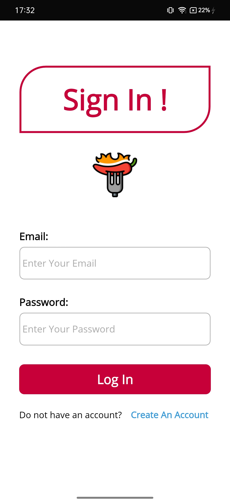
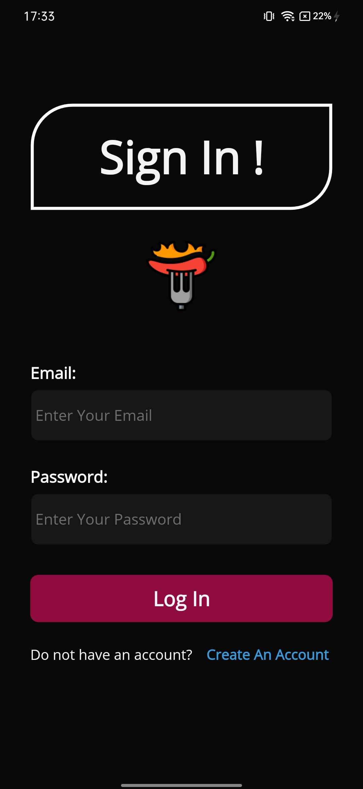
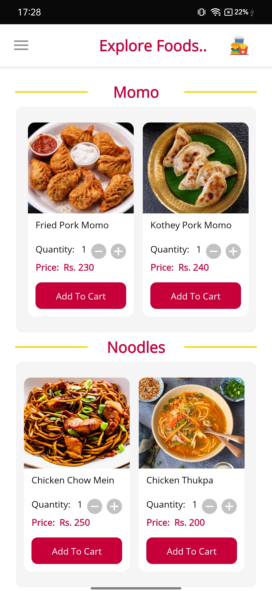
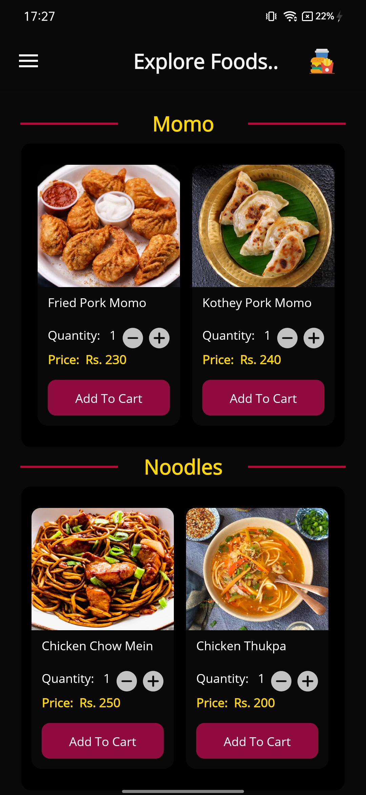
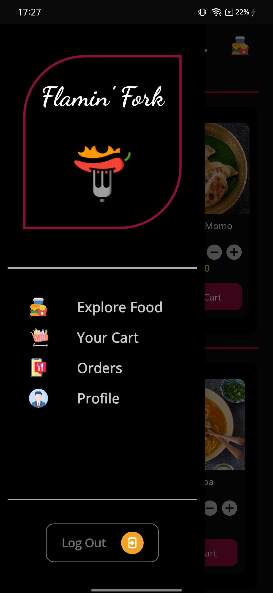
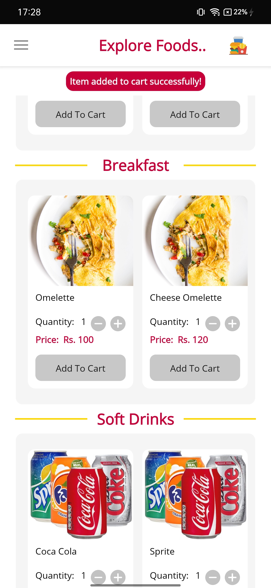
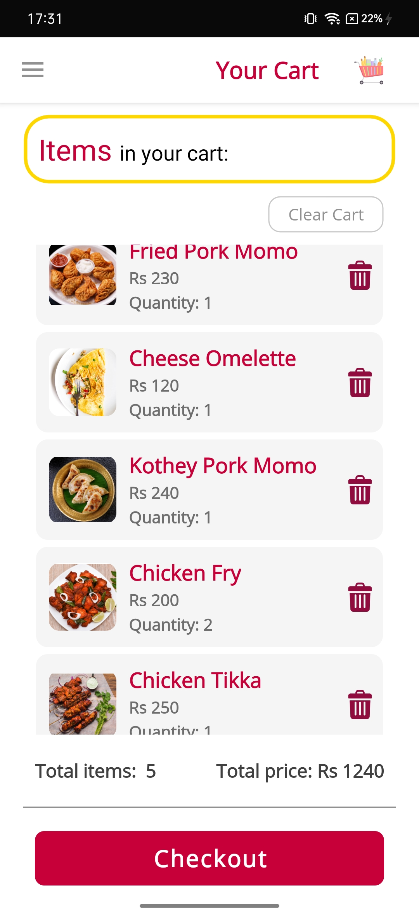
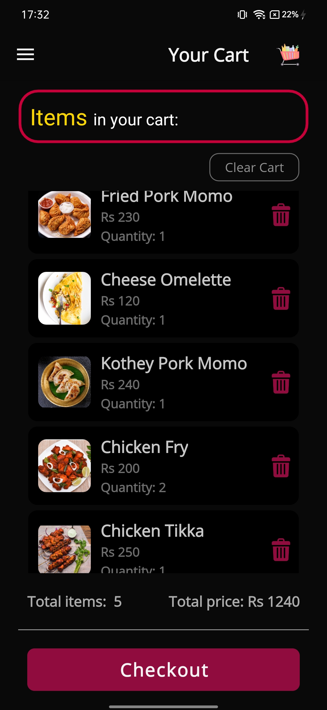
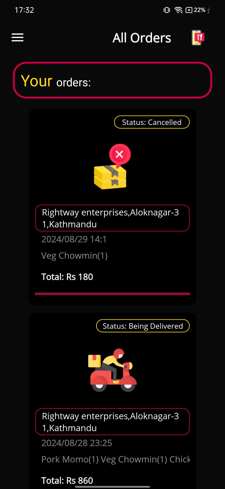

# Flaming Fork

- 'FlamingFork' is a client/customer-side mobile (Android) application built for a supposed restaurant 'Flaming Fork' using the .NET MAUI framework. The application lets customers view the restaurant menu, adjust the required number of items, add them to their cart, and finally check out from the cart, i.e., place an order.
- Additionally, the application's features include customer registration, customer authentication (Login), customer details (delivery address and contact number) editing.
- The application also lets customers view their orders and cancel their orders if the order progress (order status) is not in the later stages.

## Project Gallery

| Login Window                               | Login Window (Dark)                              | Home Window                               |
|--------------------------------------------|--------------------------------------------------|-------------------------------------------|
|  |  |   |

| Home Window (Dark)                              | Flyout (Dark)                               | Cart Operation Status                                |
|-------------------------------------------------|---------------------------------------------|-----------------------------------------------------|
|   |  |  |

| Cart Window                              | Cart Window (Dark)                            | Orders Window (Dark)                                |
|------------------------------------------|-----------------------------------------------|----------------------------------------------------|
|  | |   |
